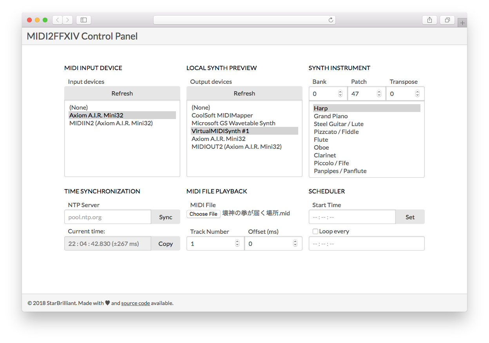

MIDI2FFXIV
==========

Convert MIDI to bard performance of Final Fantasy XIV: Stormblood

Usage
-----

Current version of the program runs on 64-bit Windows platform, with FFXIV Patch 4.3.

[Download a release](https://github.com/m13253/midi2ffxiv/releases), start the program on your gaming PC, follow the process to open the control panel. You will see this:



You may also open the control panel from your phone or another computer, as long as you know the IP address of your gaming PC.

Realtime Performance
--------------------

If you want to perform with your MIDI keyboard or MIDI controller. Select your MIDI device from "Input devices".

If you have a local synthesizer (e.g. [VirtualMIDISynth](https://coolsoft.altervista.org/en/virtualmidisynth)) and you want to use it, select it from "Output devices". Then select an instrument to match your in-game performance.

If you use VirtualMIDISynth, you can reduce the buffer time to 5 - 10 ms for lower latency.

Adjust the volume on your MIDI controller so you can hear from both the game and the synthesizer.

Then start performing! Be careful not to play notes too fast, since you may experience latency or note loss if there are less than 140 ms between notes.

Automatic Performance
---------------------

First, load a MIDI file. You may find songs in [demo](demo). Then select the track number.

- For Format-0 MIDI file, track number is always 0.

- For Format-1 MIDI file, track 0 is usually empty, your song stays in other tracks.

- For Format-2 MIDI file, your songs are in both track 0 and other tracks.

After selecting the track, click "Copy" next to "Current time". Then click "Set" next to "Start time".

The MIDI playback will begin in 5 seconds.

**Note: MIDI2FFXIV does not accept every MIDI file that you download from the Internet. Some will not play. If you know composing, I suggest you create your own MIDI file.**

Multiplayer Synced Performance
------------------------------

First, click "Sync" next to "NTP server", wait 5 or 10 seconds for synchronization to succeed.

Load your **rehearsal MIDI file**. Then select the track number.

Discuss a rehearsal time with your partner, type in the "Start time", click "Set" to start the scheduler.

During the rehearsal, adjust everyone's "Offset" value so your orchestra is in sync.

Click "Set" to stop playing, load your **performance MIDI file**.

Discuss a start time and set the scheduler.

FAQ
---

1. **Will I get banned for using this?**

   I guess you will not. I don't see any words prohibiting the use of MIDI.

   But remember, please do not burden the server by loading crazy MIDI files, and do not post any video of performing the song "Answers" otherwise you will get copyright infringement takedown.

2. **Why does the program require administrative rights?**

   This program should work without administrator, just delete the file `midi2ffxiv.exe.manifest`.

   However, for some users whose game client is run under UAC (especially FFXIV China Edition), administrative rights is required.

3. **Do I need to permit MIDI2FFXIV to go through the firewall?**

   If you need to control MIDI2FFXIV with your phone or another computer, please allow it. But if your gaming PC is directly connect to the outside Internet without any protection, I suggest you add a password (see below).

4. **How to add a password?**

   You will need to download [Go](https://golang.org/dl/) to recompile the program.

   After you have Go, download the source code of MIDI2FFXIV, edit [preset.go](preset.go), find:

   ```go
   WebListenAddr: ":65300",
   WebUsername:   "",
   WebPassword:   "",
   ```

   Change them. Then type into Command Prompt to compile the program:

   ```cmd
   cd /d "SOURCE CODE PATH"
   go get -d -u -v .
   go build
   ```

5. My anti-virus says MIDI2FFXIV is a virus!

   Mine also does.

   If you don't trust the pre-compiled program, you can compile the program yourself.

License
-------

This program is licensed under MIT License.

For more information, please refer to [LICENSE](LICENSE).
